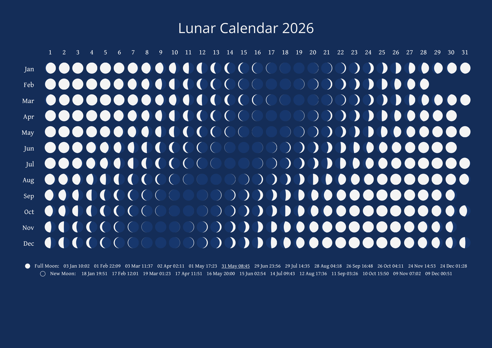

# Lunar Calendar

This Python utility will generate an HTML Lunar Calendar for the year that you specify.
To run the utility, pass the year as a command-line argument - for example:

```
python main.py 2018
```

The code uses the PyEphem library, which [you will need to install](https://rhodesmill.org/pyephem/#installation) before running it.

When running the utility, the file `template.html` must be present in the current working directory.

Examples
---

`python3 main.py -y 2026 -F`

<br>
[link to generated HTML file](pregenerated/lucal-2026-F.html)


Usage
---

```
Lunar Calendar generator
Version: 0.2.0

usage:

  python3 main.py [-h] [-v] [-y year] [-E] [-M] [-S] [-F] [-o output_file] [-i moon_image] [year]

    -y year         Year to generate
    -o output_file  Output HTML (default 'lunar_calendar_YEAR.html')
    -M              Use moon image
    -E              Enhance new, full, black and blue moon images with colors (image only)
    -S              Succinct (remove footer and new/full moon dates)
    -F              Remove only the footer
    -c              Background color (hex format or rgb format, default #142d58)
    -i moon_image   Moon image to use ('data/supermoon_l3_bw_s.png')
    -h              Help (this screen)
    -v              Print version
```


As well as displaying the phase of the moon for each day of the year, the calendar lists the exact dates and times of each full moon
and new moon, highlighting any [blue moons](https://en.wikipedia.org/wiki/Blue_moon) or [black moons](https://en.wikipedia.org/wiki/Black_moon) that occur.
